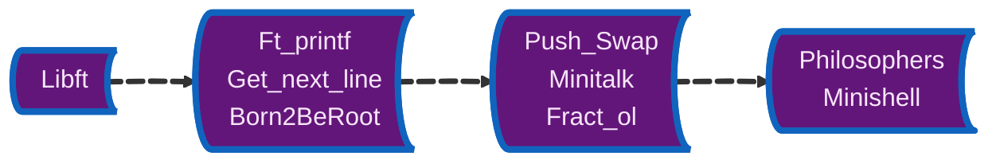

  

- 👋 Hi, I’m José and I'm a pharmacist 💊.
- 👀 I’m interested in informatics and healthcare.
- 🌱 I’m currently learning Computing Science (3º year).
- 🖥️ Also a 42 School student.

## 🛠️ Languages and Tools

  Mainly Java and C.
   
  
   
  
   
  
  
   

## 💻 42 School Progress

  
  
  
  
  
  
  

  
  
  
  
  
  
  

## 📫 Contacts

  
  

## ⚡️ Stats

  
   
  
   
  

